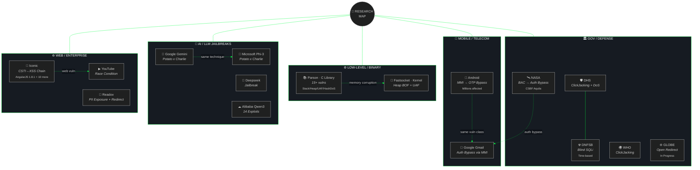

<div align="center">

<!-- HEADER -->


<br>

<!-- SOCIAL BADGES -->
[](https://linkedin.com/in/ayukotsu)
[](https://spectra-vrg.org)
[](https://github.com/KazamaDono)
[](https://github.com/KazamaDono?tab=followers)
[](https://github.com/KazamaDono)

</div>

<!-- ABOUT -->
## `> cat /etc/motd`

```
I break things to understand them, then build tools so machines can break them faster.
```

Offensive security researcher and systems engineer focused on **automated vulnerability discovery**.  
Currently building AI agents that find real bugs autonomously — not theoretical, reproducible.

<!-- TECH STACK -->
## `> ls /opt/toolkit/`

<div align="center">

#### Languages


#### Offensive Security


#### Engineering & AI


</div>

<!-- PROJECTS -->
## `> ls -la ./arsenal/`

<table>
<tr>
<td align="center" width="33%">

<a href="https://github.com/KazamaDono/deepvoid">

</a>

**Omni-Recon Engine**  
<sub>Automated reconnaissance & vulnerability assessment. Enter a URL, get a full attack surface map.</sub>

`nuclei` `sqlmap` `dalfox` `katana`

</td>
<td align="center" width="33%">

<a href="https://github.com/KazamaDono/7">

</a>

**Voice AI Assistant**  
<sub>Agentic voice AI with tool-calling, security skills, and hologram UI. Fully local via Ollama.</sub>

`langchain` `ollama` `pyqt5` `speech`

</td>
<td align="center" width="33%">

<a href="https://github.com/KazamaDono/Ghosttrigger">

</a>

**Auth Bypass Scanner**  
<sub>Automated scanner for UI-based authentication bypass in web applications.</sub>

`selenium` `bypass` `auth` `scanner`

</td>
</tr>
</table>

<!-- RESEARCH -->
## `> cat /var/log/research.log`

<div align="center">

#### Discovered vulnerabilities within

</div>



<div align="center">


</div>

<details>
<summary><b>📋 Full Research Table — click to expand</b></summary>

<br>

| Domain | Target | Vulnerability | Class | Severity |
|:---:|---|---|---|:---:|
| 🏛 | **NASA** | BAC → authentication bypass in CSBF Aquila — [writeup](https://spectra-vrg.org/hackers-handbook/Bypassing_Auth_CSBF.html) | Auth Bypass | 🔴 |
| 🏛 | **Dept. of Homeland Security** | ClickJacking + Reflected client-side DoS via unsanitized search param | ClickJack / DoS | 🟠 |
| 🏛 | **Defense Nuclear Facilities Safety Board** | Blind time-based SQL injection | SQLi | 🔴 |
| 🏛 | **WHO** | ClickJacking | ClickJack | 🟡 |
| 🏛 | **GLOBE** *(globe.gov)* | Open redirect | Redirect | 🟡 |
| 📱 | **Google (Gmail)** | Auth bypass via Android MMI code vulnerability | Auth Bypass | 🔴 |
| 📱 | **Android** | MMI abuse for OTP bypass — millions of devices affected | OTP Bypass | 🔴 |
| ⚙ | **Parson** *(C library)* | 15+ vulns: stack BOF in `person_sprintf`, heap over-read in UTF-8, integer overflow in serialization, UAF, TOCTOU, HashDoS via djb2, uncontrolled recursion (4 vectors) | Memory Corruption | 🔴 |
| ⚙ | **Fastsocket** *(kernel module)* | Heap BOF in `fsocket_fd_set`, stack BOF in arg parsing, UAF in pool allocator | Memory Corruption | 🔴 |
| 🤖 | **Google Gemini** | Jailbreak (Potato x Charlie) | LLM Jailbreak | 🟠 |
| 🤖 | **Microsoft Phi-3-Mini** | Jailbreak (Potato x Charlie) | LLM Jailbreak | 🟠 |
| 🤖 | **Deepseek** | Jailbreak | LLM Jailbreak | 🟠 |
| 🤖 | **Alibaba Qwen3:1.7B** | 14 jailbreak exploits | LLM Jailbreak | 🟠 |
| 🌐 | **Iconic** | CSTI → XSS chain via AngularJS 1.8.1, double URL encoding bypass, CORS misconfig, CSP bypass + 6 more | XSS / Injection | 🔴 |
| 🌐 | **YouTube** | Race condition | Race Condition | 🟡 |
| 🌐 | **Readov** | Exposed endpoint PII leak + Post-Auth open redirect | PII / Redirect | 🟠 |

<br>

*...and more across healthcare, education, and enterprise targets.*

</details>

<!-- GITHUB STATS -->
## `> cat /var/log/stats.log`

<div align="center">


</div>

<div align="center">


</div>

<!-- TROPHIES -->
<div align="center">


</div>

<!-- ACTIVITY GRAPH -->
## `> tail -f /var/log/activity.log`

<div align="center">

[](https://github.com/KazamaDono)

</div>

<!-- SNAKE -->
<div align="center">

<picture>
  <source media="(prefers-color-scheme: dark)" srcset="https://raw.githubusercontent.com/KazamaDono/KazamaDono/output/github-snake-dark.svg" />
  <source media="(prefers-color-scheme: light)" srcset="https://raw.githubusercontent.com/KazamaDono/KazamaDono/output/github-snake.svg" />
  
</picture>

</div>

---

<div align="center">

*"The best defense is knowing how the offense works."*

<br>


<br>

<sub>*"Mikasa caused the rumbling..." — and I'll die on this hill.*</sub>

<br>


</div>
